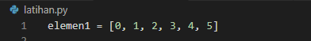
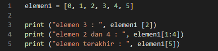
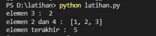
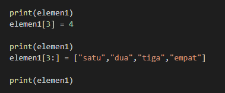
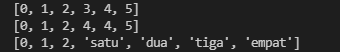
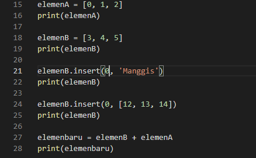
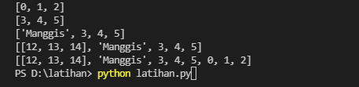
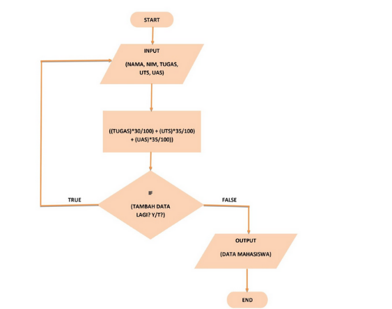
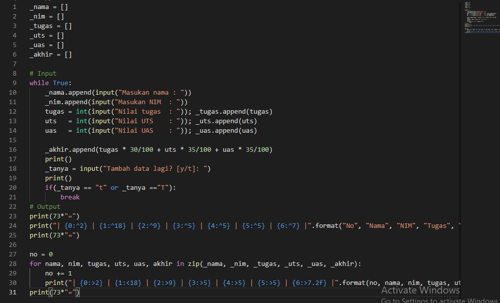
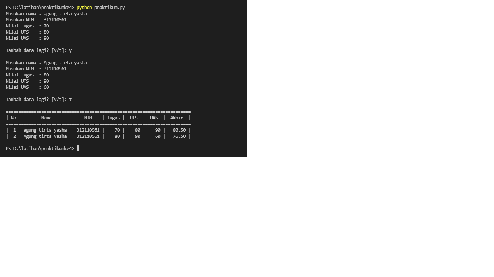

# latihan 

## Menambahkan List

Kita bisa menggunakan perintah print() untuk melihat isi dari sebuah list, baik secara menyeluruh maupun sebagian.

Pada Kode program pertama, tambahkan kode program berikut ini untuk menampilkan semua isi dari list:

Kita juga bisa menampilkan isi tertentu dari list dengan menggunakan indeks. Setiap data pada list memiliki indeks sebagai alamat. Dan indeks adalah sebuah nilai integer dimulai dari 0 yang menjadi acuan di mana sebuah data disimpan di dalam list.

Tambahkan kode program berikut:

### Output

## Mengubah data dalam list

list adalah tipe data yang bersifat changable alias bisa diubah. Bagaimana cara mengubah data di dalam list?
Caranya mudah, seperti mengubah nilai variabel pada umumnya. 
Perhatikan contoh berikut:

### Output 

## Menambahkan data dalam list 

Setelah kita mengubah data pada list, sekarang kita akan mencoba untuk menambahkan sebuah data baru ke dalam list. Tidak hanya terbatas indeks 0, kita juga bisa memasukkan nilai pada indeks berapa pun pada list.

### Output 

 
 # Tugas Praktikum 4

 ### Flowchart 
 
 

 saya menggunakan perintah while untuk mengulang pertanyaan yang akan diinput. maka outputnya akan ada pertanyaan tambah data jika jawab "y" maka pertanyaan akan terulang kembali dan diiput kembali seperti sebelumnya, jika menjawab "t" maka perintah selesai dan keluar output hasil inputan. dengan cara itu kita bisa menginput lebih dari 1 inputan atau sesuai yg kita inginkan.

 ### input 

 

 ### output

 

 ### Terima Kasih 
 